title: Transport Simplification through Network Disaggregation and
Reassembly body: \|

Transport Network Simplification through Network Disaggregation and Reassembly
==============================================================================

Overview
--------

Geographic representations of networks, such as transport networks,
typically consist of end-point, junctions and simply-connected nodes.
Where a simply-connected node is a node which is only connected to two
other nodes. In the following diagram B is a simply-connected node:

          Simply-connected network                     Simplified network
  ----------------------------------------- -----------------------------------------
      

As this is a transport network the directed representation is then
convered to a bi-directional graph.

Geographic networks then typically consist of a large number of
simply-connected nodes with a smaller number of end-point or
simply-connected. For example, analysis of the OpenStreetMap (OSM)
British rail-network shows 497 359 nodes with 506 337 edges but, once
duplicate edges are removed, and bi-directional edges of the 1 012 604
segments 925 172 (91.4%) are simply-connected.

A simplified junction and end-node network is then created by combining
all simply-connected nodes using an edge colouring algorithm to a
bi-directional copy of the base network.

Network disaggregation
----------------------

The bi-directional network is created by disaggregating the based
network into its component edges and adding missing edges

### Initial network disaggregation and assembly

The creation of the inital segmented network is as follows:

1.  The base network is broken into its constituent edges. Each edge
    corresponds to a source-and-target pair in the base network
2.  Existing Bi-directional source-target/target-source edges are
    identified
3.  The network completed by adding missing bi-direction edges
4.  A unique logical colour allocated to each edge in this segmented
    network

                Base network                          Bi-directional network
  ----------------------------------------- -------------------------------------------
      

### Deduplication of parallel edges and counting nodes

As the edge count for a given node is used to identify simply-connected
nodes, parallel edges (edges with identical source and target nodes) are
output and duplicates edges combined, and the edge count for each node
calculated

### Identification of network links

Using the source and target edge, node and edge count for a give node
the edges linking nodes are identified

1.  For each edges corresponding source and target node and edge counts
    are determined
2.  Source and target nodes are combined to identify inbound and
    outbound edges for a give node
3.  Links are pruned to remove:

-   Simple loops where the inbound-source and outbound-target nodes are
    the same
-   Complex end points where the outbound target-node edge-count is
    three or more

Network simplication
--------------------

The the network is simplified by colouring of edges corresponding to
simple-elements when reassembling the disaggregated network:

### Colouring of edges

The network is segmented by giving the source edge-colour to all linked
simply-connected edges:

1.  All active segments are identified, where the target-node edge-count
    is two and source-node edge-count is not two
2.  For every active-segment, identify the corresponding current
    source-node, source-edge and target-edge
3.  If this target-edge is simply-connected

-   Apply the source-edge colour to the target-edge
-   Make the current target-edge the source-edge
-   Repeat stage 3 until the target-edge is not simply connected

4.  Iterate through all active segments

### Colouring of simple loops

A loop with three nodes simply-connected edges is problematic as all
nodes in the loop are simply connected. This can prove problematic as is
shown in ID W013 and W014 examples below

                  Simple-loop                           Bi-directional loop
  -------------------------------------------- --------------------------------------
      

To address this, an arbitary edge is selected and the colour is applied
to the two adjacent edges

1.  All active segments are identified, where the target-node and
    source-node edge-count is two and the edge has not previously been
    visited
2.  Apply the source-edge to the child target-edge and the grand-child
    target-edge
3.  Iterate through all active loops

The result is then

                  Simple-loop                             Simplified loop
  -------------------------------------------- --------------------------------------
      

### Reassembly of the simplified network

The simplified network is reassembled by segmenting the network based on
the logical colour of edges and nodes. The first source node and edge is
identfied and the network segment is traversed collating intermediate
nodes, until the segment end-node is identified

1.  All start-edges are identified for a given colour of segment, where
    the intial and updated edge colour are the same
2.  For every start-segment, identify the corresponding current
    start-node, start-edge and target-edge
3.  If this target-edge is not a loop and not the start-edge

-   Collate the source node
-   Make the current target-edge the source-edge
-   Repeat stage 4 until the target-edge is a start-edge

4.  Gather the start- and end- nodes for the segment colour
5.  Iterate through all start-edges segments

The reassembled simplified network consisting of aggregated start- and
end- node is then output

Examples
--------

To illustrate the input and simplified networks a based set of example
graphs are considered:

### Simple networks

These are examples of trivial base network simplification

#### Two node networks

Examples of a simple directed network

      ID            Simply-connected network                  Simplified network
  ---------- -------------------------------------- --------------------------------------
   **W001**      
   **W002**      

#### Simple three node networks

Examples of three nodes with permutations of directed source and target
nodes simpliplications

      ID            Simply-connected network                  Simplified network
  ---------- -------------------------------------- --------------------------------------
   **W003**   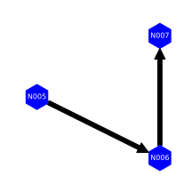   
   **W004**   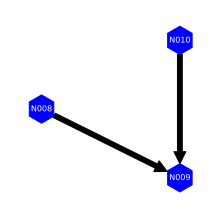   
   **W005**      
   **W006**   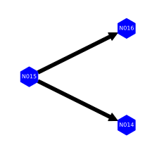   

#### Three node loops

Examples of three nodes forming loops with permutations of directed
source and target nodes

      ID            Simply-connected network                  Simplified network
  ---------- -------------------------------------- --------------------------------------
   **W007**   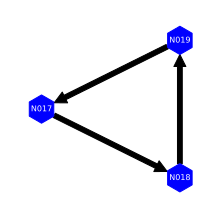   
   **W008**      
   **W009**   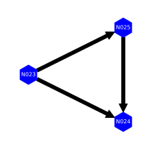   

### More complex networks

These are example simplifications of more complex base networks that
typically caused problems when developing this simplification approach

#### A node with three edges

An example of a four-node network with a node with three edges

      ID            Simply-connected network                  Simplified network
  ---------- -------------------------------------- --------------------------------------
   **W010**      

#### Five node networks

An example of a simple connected five-node network and a with a multiply
connected node

      ID            Simply-connected network                  Simplified network
  ---------- -------------------------------------- --------------------------------------
   **W011**      
   **W012**      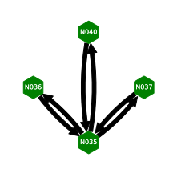

### Problematic three-node loops networks

An example of a four-node network with a three-node loop. The
introduction of a connected node breaks the symmetry of the three-node
loop and the asymmetry makes it unclear how these cases should be
resolved as the three node loop forms the start or the end of a simply
connected network

      ID            Simply-connected network                  Simplified network
  ---------- -------------------------------------- --------------------------------------
   **W013**      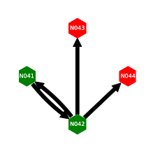
   **W014**      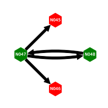

### Five node networks with loops

Examples of five node networks with an embedded three node loop. In
these cases the three node loop is flattend

      ID            Simply-connected network                  Simplified network
  ---------- -------------------------------------- --------------------------------------
   **W015**   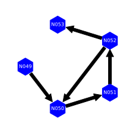   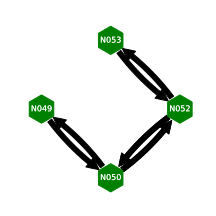
   **W016**   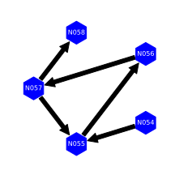   

### Six node networks with loops

Examples of five node networks with an embedded three and four node
loop. Where possible the three and four node loops are flatten.

      ID            Simply-connected network                  Simplified network
  ---------- -------------------------------------- --------------------------------------
   **W017**   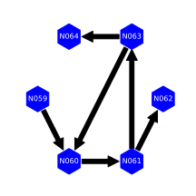   
   **W018**      
   **W019**      

### Errata

Examples of five node networks with an embedded three node loop. Where
possible the three loops is flattened.

      ID            Simply-connected network                  Simplified network
  ---------- -------------------------------------- --------------------------------------
   **W020**      

Summary
-------

This algorithmic method is an approach to simplify a network for the
disaggregation and reassembly of a simplified network in which resolving
data issues such missing or duplicated elements, and of loops.

This consists of implementation the method along with test-data and
visualisation tool developed using the
[pandas](http://pandas.pydata.org/), [numpy](https://www.numpy.org/) and
[networkx](https://networkx.github.io) python3 packages
